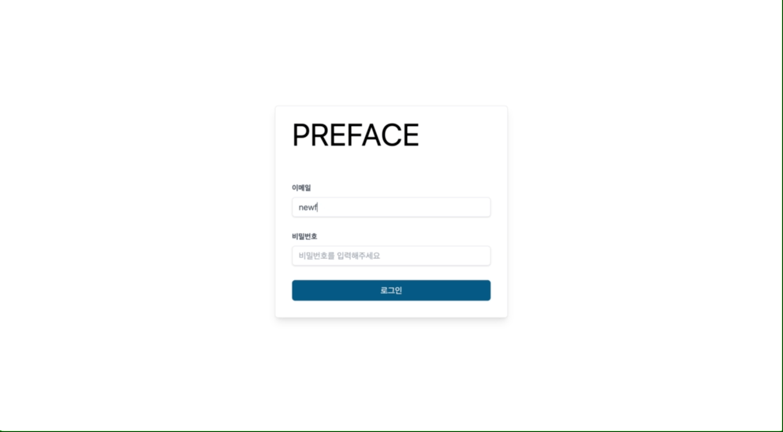

# 🍀 원티드 프리온보딩 프론트엔드 11조

## [배포 사이트 바로가기](https://inspiring-peony-b78e2c.netlify.app/) 👈🏻 click!

아래 사전에 생성된 계정으로 로그인해서 체험해주세요.

```
id : newface@dco.com
pw : test1234
```

1. [팀 소개](#팀-소개)
   - 팀원 소개
   - 소통 방식과 과제 진행 방식
   - 실행방법
2. [프로젝트 소개](#프로젝트-소개)
   - 프로젝트 구조
   - 폴더 구조
3. [우리 팀의 Best Practice](#우리-팀의-best-practice)

---

## 👋 팀 소개

안녕하세요, 원티드 프리온보딩 프론트엔드 11조입니다!

### 팀원 소개

<table>
  <tr>
    <td align="center">
      
    </td>
    <td align="center">
      
    </td>
    <td align="center">
      
    </td>
    <td align="center">
      
    </td>
    <td align="center">
      
    </td>
    <td align="center">
      
    </td>
    <td align="center">
      
    </td>
  </tr>
  <tr>    
    <td align="center">
      <a href="https://github.com/devyouth94">
        <div>김영진</div>
      </a>
    </td>
    <td align="center">
      <a href="https://github.com/SimYuseon">
        <div>심유선</div>
      </a>
    </td>
    <td align="center">
      <a href="https://github.com/hemudi">
        <div>김수민</div>
      </a>
    </td>
    <td align="center">
      <a href="https://github.com/ryong9rrr">
        <div>용상윤(팀장)</div>
      </a>
    </td>
    <td align="center">
      <a href="https://github.com/chaechae66">
        <div>박채연</div>
      </a>
    </td>
    <td align="center">
      <a href="https://github.com/6mn12j">
        <div>박민주</div>
      </a>
    </td>
    <td align="center">
      <a href="https://github.com/0SCAR0421">
        <div>정연우</div>
      </a>
    </td>
  </tr>
</table>

### 소통 방식과 과제 진행 방식

저희 팀은 소통 방식으로 디스코드와 노션을 활용했습니다. 디스코드에서 어떤 방식이 더 나을지 투표를 하거나 어떤 코드가 좋은 코드일지 토론을 하였습니다.

토론 후 전체적인 과제 진행은 팀장이 진행하였습니다. 그리고 1명이 대표로 라이브코딩을 하고 1명이 회의록을 작성하였습니다. 나머지 팀원들은 라이브코딩에 모두 참여하여 네이밍 컨벤션이나 코드 구조 등에 대해 피드백을 주고 받으며 Best Practice를 찾기 위해 노력했습니다.

---

### 실행방법

1. 이 저장소를 클론해주세요. `git clone ...`

2. 의존성 모듈을 설치해주세요. `npm install`

3. root 경로에 `.env.local` 파일을 만들고 아래와 같이 환경변수를 추가해주세요. (배포한 서버 주소입니다.)

`VITE_APP_API_END_POINT=https://api.oscar0421.com`

3. 실행해주세요. `npm run dev`

## 🚀 프로젝트 소개



제공받는 API를 이용하여 투자 관리 서비스를 구축합니다.

### ✅ 구현 기능 체크리스트

**공통**

- [x] Header, Sidebar, Footer 컴포넌트 레이아웃 구현
  - [x] 사이드바 하이라이트 기능
- [x] 로그인, 로그아웃 기능
- [x] 새로고침 시 정보 유지 기능

**계좌**

- [x] 계좌 목록을 API로 불러와서 렌더링합니다.
  - [x] 테이블 필드를 렌더링하는 규칙을 지킵니다.
  - [ ] 브로커명, 계좌 활성화 여부, 계좌 상태를 필터링 하는 기능
  - [x] 계좌 검색 기능
  - [x] Pagination 기능
- [x] 계좌 상세 정보를 API로 불러와서 렌더링합니다.
  - [x] 계좌 정보 수정이 가능합니다.
  - [ ] 계좌의 사용자 명을 누르면 사용자 상세로 이동합니다.

**사용자**

- [x] 사용자 목록을 API로 불러와서 렌더링합니다.
  - [x] 테이블 필드를 렌더링하는 규칙을 지킵니다.
  - [ ] 활성화 여부, 임직원 계좌여부에 따른 필터링 기능
  - [x] 검색 API를 이용하여 사용자를 검색할 수 있습니다.
  - [x] Pagination API를 이용하여 페이지네이션 기능을 구현합니다.
  - [ ] 신규 사용자를 추가 기능
  - [ ] 사용자 삭제 기능
  - [ ] 사용자 정보 수정 기능
- [x] 사용자 상세 정보를 API로 불러와서 렌더링합니다.

### 🗂 폴더 구조

<details>
<summary>폴더 구조</summary>
<div markdown="1">

```
src
 ┣ components
 ┃ ┣ atom // Button, Loading과 같이 가장 단위가 작은 컴포넌트입니다.
            어떤 컴포넌트에 의존되지 않고 어디서나 사용될 수 있는 컴포넌트들의 집합입니다.
 ┃ ┣ common // Layout, Sidebar, Modal 과 같이 atom보다는 큰 단위로,
              어디서나 사용될 수 있는 컴포넌트들의 집합입니다.
 ┃ ┗ domain // Account, Auth 처럼, 특정 기능들에 연관되어있는 컴포넌트들의 집합입니다.
 ┣ lib // api, data, hooks, utils, model, types등 전반적으로 프로젝트 전체를 위해 필요한 모듈을 관리합니다.
 ┣ pages // Page 단위의 컴포넌트입니다.
 ┣ router // 라우팅에 관한 모듈입니다.
 ┣ styles // 스타일에 관한 모듈입니다.
 ┣ App.tsx
 ┣ main.tsx
```

</div>
</details>

---

## 👍 우리 팀의 Best-Practice

1. Vite 사용하기

Vite를 사용한 팀원도 있었고, 아닌 팀원도 있었는데 Vite를 사용한 팀원들은 모두 "정말 빠르다!" 라고 느꼈습니다. 👍

2. `React-Query` 사용하기

이번 과제에서는 api를 호출할 부분이 정말 많았습니다. 따라서 성능면에서 리액트 쿼리가 제공하는 캐싱 기능이 필요하다고 생각하여 해당 기술을 처음 적용해보았습니다.

3. 최대한 간단하고 직관적인 폴더구조를 확립했습니다.

가장 바깥에는 `components`, `router`, `pages` 와 같이 View와 관련된 폴더를 두고, `lib`이라는 폴더를 생성하여 기능과 연관된 모듈들을 위치시켰습니다.

또한 협업을 한 것이 아니기 때문에 100% 완벽하지는 않지만, `components` 를 `atom`, `common`, `domain`으로 나눔으로서 컴포넌트의 역할에 따라 분리하였습니다. 따라서 저희 팀은 팀원들이 의식적으로 컴포넌트는 작은 단위의 컴포넌트가 너무 큰 역할을 가지지 않도록 하는 것을 연습했습니다.

4. `model`과 `type`을 구분짓자.

얼핏 생각하기에 `model`과 `type`의 차이를 느끼지 못할 수 있습니다. 하지만 이번 과제에서 가장 중요한 도메인이었던 `Account`와 `User` 정보를 `model`로 구분하고 도메인 타입이 아닌 기능 구현에 관련된 타입을 `types`로 구분하여 모델과 타입간의 혼선이 있지 않도록 했습니다.
